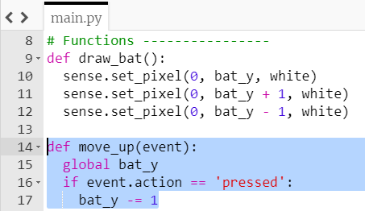
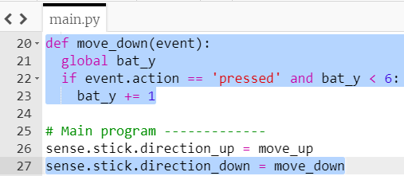

## Move the bat

Let's make the bat move up and down when the joystick on the Sense HAT is moved.

+ In your functions section, start a new function called `move_up(event)`

This function will be passed some data called `event`. The event data it will receive is what has happened to the Sense HAT joystick. This will include the time that the stick was used, the direction it was pushed, and whether it was pressed, released, or held.

+ Inside the function, add an `if` statement to test if the `event.action` was 'pressed', or in other words the joystick was moved.

```python
if event.action == 'pressed':
```

If the condition is met, we want the bat to move up. Upwards on our coordinates means making the number smaller - remember that the top pixel is 0.

+ If the `event.action` was 'pressed', take away 1 from the `bat_y` coordinate. Because the `bat_y` variable is defined outside of this function, we also have to tell Python to use the **global** version of this variable so that we are allowed to change it from inside the function.



Remember that just like our `draw_bat` function, this function will do nothing until it is **called**.

+ In main program section, add this line of code above the `draw_bat` function call. This code says _"When the Sense HAT stick is pushed up, call the function `move_up`."_

``` python
sense.stick.direction_up = move_up
```

If you run your code at this point, nothing will happen. This is because we need to continually check whether the player has moved the joystick and redraw the bat, rather than only checking once when the program is run.

+ In your main program section, put the function call to `draw_bat` inside an infinite loop.

[[[generic-python-while-true]]]

If you have used Scratch before, this should be familiar as it is the same as a forever loop


+ Save and run your code. Press the joystick on the Sense HAT up (or use the arrow keys on your keyboard if you are using the emulator).


Oh dear, the result looks a bit like you are smudging the bat up the screen rather than moving it! We need to clear the screen and wait a while in between each time the infinite loop draws the bat


+ Add this line to your infinite loop to clear the LED matrix in between the bat being drawn each time.

``` python
sense.clear(0, 0, 0)
```

+ Add a line inside the loop after `draw_bat` to sleep for 0.25 seconds

[[[generic-python-sleep]]]

+ Save and run your code again. Try moving the bat and check whether it now moves up as expected.

If you move the bat too far up, your program tries to draw the bat off the LED grid and the program crashes. You need to make sure that the `bat_y` variable never goes lower than 1 so that the bat remains on the grid at all times.

+ Add code to your `move_up` function to make sure the `bat_y` variable never goes lower than 1.


+ Now follow these steps again but with a few changes to make it possible to move your bat **down** the LED matrix.

--- hints ---
--- hint ---
Begin by writing a `move_down(event)` function containing instructions for when the bat should be moved down. This time you should add one to `bat_y` but only if `bat_y` is less than 6 to keep it on the grid.

--- /hint ---

--- hint ---
You will need to use another line of code in your main program section to call the `move_down` function when the joystick is moved down.

``` python
sense.stick.direction_down = move_down
```

--- /hint ---

--- hint ---
Here is how your code should look:



--- /hint ---

--- /hints ---
