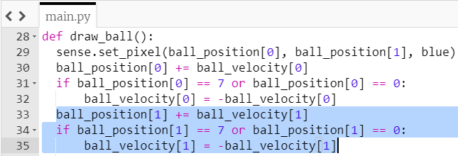

## Move the ball

To get the ball moving, you need to change its `x` position by its `x` velocity, and its `y` position by its `y` velocity.

The first coordinate in each list you just created represents the ball's `x` property — so `ball_position[0]` is the current `x` coordinate, and `ball_velocity[0]` is how fast it should move in the `x` direction.

+ Inside your `draw_ball` function, add this line of code to add the ball's velocity (currently `1`) to the ball's current position in the `x` direction.

``` python
ball_position[0] += ball_velocity[0]
```


+ Save and run your code. The ball will move across the screen until it reaches the edge, and then the program will crash. Why do you think this happens?

--- collapse ---
---
title: Answer
---
You've probably seen the same error before when you moved the paddle. The ball moves across the LED matrix and then the program crashes with the error `ValueError: X position must be between 0 and 7`.

The ball moved to an `x` position larger than 7, which is outside of the LED matrix.
--- /collapse ---

+ Immediately after the line of code to move the ball, add a conditional stating that, if the `ball_position[0]` reaches `7`, its velocity gets reversed so it goes in the other direction:

``` python
if ball_position[0] == 7:
    ball_velocity[0] = -ball_velocity[0]
```

+ Save and run your code again. The ball should bounce off the right edge of the matrix — but when it reaches the left edge, you'll get another error because it is still trying to move off the screen in that direction!

+ Add to the conditional to say that the ball should reverse direction if its position is equal to `7` **or** is equal to `0`.

--- hints ---
--- hint ---
Add your extra condition at the point highlighted in blue:


--- /hint ---

--- hint ---
Here is how your code should look:
``` python
if ball_position[0] == 7 or ball_position[0] == 0:
    ball_velocity[0] = -ball_velocity[0]
```
--- /hint ---
--- /hints ---

--- collapse ---
---
title: Why does this work?
---
The ball's velocity starts off as `1`. If the ball's `x` position equals `7`, we change the `x` velocity to `-1` to make the ball reverse. Then the code will be adding `-1` to the ball's `x` position to move the ball to the left across the matrix.

But why does this work when the ball gets all the way to the left? Look at the code:

```python
ball_velocity[0] = -ball_velocity[0]
```

When the ball is travelling leftward, its `x` velocity is `-1`. When we insert this value in the line of code, we get the following:

```python
ball_velocity[0] = -(-1)
```

Minus (minus one) equals...plus one! So the velocity is now `1`, and the ball begins travelling back the other way.
--- /collapse ---

+ Save and run your program to check that your ball bounces happily from the left edge to the right edge.


+ Now make your ball move according to its `y` velocity as well as its `x` velocity by following these steps again with a few changes.

--- hints ---
--- hint ---
Begin by adding one line of code at the bottom of the `draw_ball` function to make your ball move according to `ball_position[1]` and `ball_velocity[1]`. This line is almost the same as the code you used for changing the `x` coordinate of the ball.

--- /hint ---

--- hint ---
Next, add a conditional to say that if the ball's `y` position gets to `0` or `7`, the ball should reverse direction. Again, to do this you just need to use the code you added for the `x` position with a few changes.
--- /hint ---

--- hint ---
The highlighted code is the part you should add:



--- /hint ---

--- /hints ---
